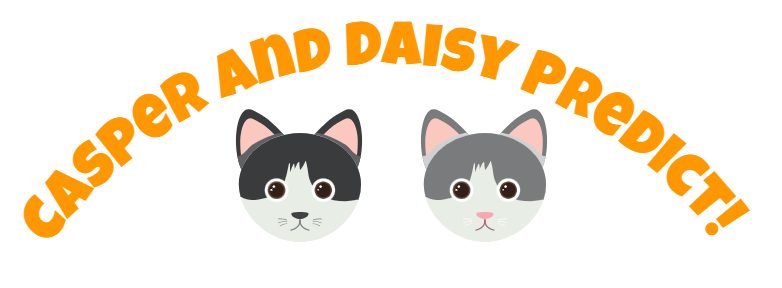

# casperanddaisy

Casper and Dasiy predict things, a bit like Paul the Octopus?

## How to run locally
This is an Angular app, so you will need Node.JS installed.  Then run `npm install` and `npm start` to fire up the app on http://localhost:4200

All the data for the app is held locally in JSON files, so there is no API component to run.
